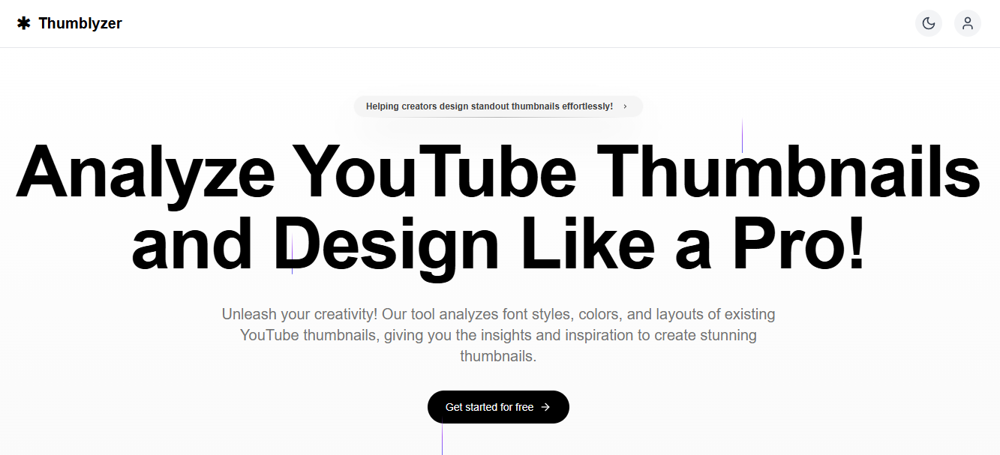

# 🎯 **Thumblyzer** – YouTube Thumbnail Analyzer & Design Assistant  

> *A smart, quick-and-friendly thumbnail analyzer powered by **Gemini AI**, built for creators and thumbnail designers.*

<p align="center">
  
  <br/>
  <i>Analyze. Improve. Create Better Thumbnails.</i>
</p>

---

## 🚀 What is **Thumblyzer**?  

**Thumblyzer** is an intelligent web-application built with **Next.js + TypeScript**, powered by **Google Gemini AI**, that helps content creators craft better YouTube thumbnails by analysing what works — and showing you *why*.  

With AI-driven visual insights, you can uncover how design choices affect visibility, readability, and overall appeal.  

---

## 🧠 How It Works  

- 🧾 **Paste a YouTube video URL** — Thumblyzer fetches the video’s thumbnail automatically.  
- 🤖 **Gemini AI analyzes** the thumbnail image to extract design details such as:  
  - 🎨 **Fonts & text styles** (type, size, weight, placement)  
  - 🌈 **Color palette** and dominant hues (contrast, mood, brand consistency)  
  - 🧩 **Layout & composition** (subject position, text-to-image balance)  
- 📊 **Actionable insights** are generated to help you refine your thumbnail for higher click-through performance (CTR).  

---

## 💡 Why Use It?  

✅ **Save Time** – Skip the guesswork; instantly analyze what top creators are doing.  
🌟 **Improve Visual Impact** – Ensure your thumbnail grabs attention and reads clearly at any size.  
🎓 **Learn Design Secrets** – Understand how fonts, colors, and layouts drive performance.  

---

## 👥 Who’s It For?  

🎬 **YouTubers** – Evaluate and enhance your video thumbnails.  
🎨 **Designers** – Study real-world thumbnail design trends and composition patterns.  
📈 **Marketers** – Discover what visually attracts clicks and conversions.  

---

## 📸 Demo & Preview  

🔗 **Live Demo:** [https://thumblyzer.vercel.app](https://thumblyzer.vercel.app)  
*(Click to try it out!)*  

<p align="center">
  
  <br/>
  <sub><i>Replace this image path with your actual screenshot.</i></sub>
</p>

---

## 🛠️ Features  

- ⚡ Built on **Next.js** + **TypeScript** for a fast, modern developer experience  
- 🤖 **Powered by Gemini AI API** for intelligent image analysis  
- 💻 Responsive UI using **Tailwind CSS**  
- 🖼️ Upload, drag-and-drop, or fetch from YouTube URLs  
- 🧠 Analyzes font details, color palettes, and layout balance  
- 📊 Provides actionable improvement suggestions  
- ☁️ Easy to deploy (Vercel, Netlify, or any Next.js-supported platform)  
- 🧩 Open-source and customizable  

---

## 🧩 Tech Stack  

| Layer | Technology |
|-------|-------------|
| **Frontend** | Next.js, React, TypeScript |
| **Styling** | Tailwind CSS |
| **AI Engine** | Gemini AI (via Google Generative Language API) |
| **Build Config** | `next.config.ts`, `tsconfig.json`, `postcss.config.mjs` |
| **Structure** | `app/`, `components/`, `context/`, `helpers/`, `hooks/`, `lib/` |

---

## ⚙️ Getting Started  

### 🔧 Prerequisites  
- Node.js (v14 or newer)  
- npm, yarn, or pnpm  
- A valid **Gemini API key** from [Google AI Studio](https://makersuite.google.com/app/apikey)  

### 🧱 Installation  
```bash
# Clone the repo
git clone https://github.com/parthergk/Thumbnailer.git
cd Thumbnailer

# Install dependencies
npm install
# or
yarn
# or
pnpm install
